# bookia_app
## ✨ Key Features

- 🌓 **Dual Theme Support**: Light & Dark mode designed for optimal reading and browsing experiences.
- 🌐 **Multi-Language (Localization)**: Complete RTL & LTR layout support (Arabic & English).
- 🔐 **Authentication Flow**: User onboarding, login, registration, and password recovery interfaces.
- 📱 **Responsive Design**: Screen utility integration for pixel-perfect layout across various device sizes.

---

## 📱 App Screenshots
| Screen | Arabic (RTL) | English (LTR) |
| :--- | :---: | :---: |
| **Code** | 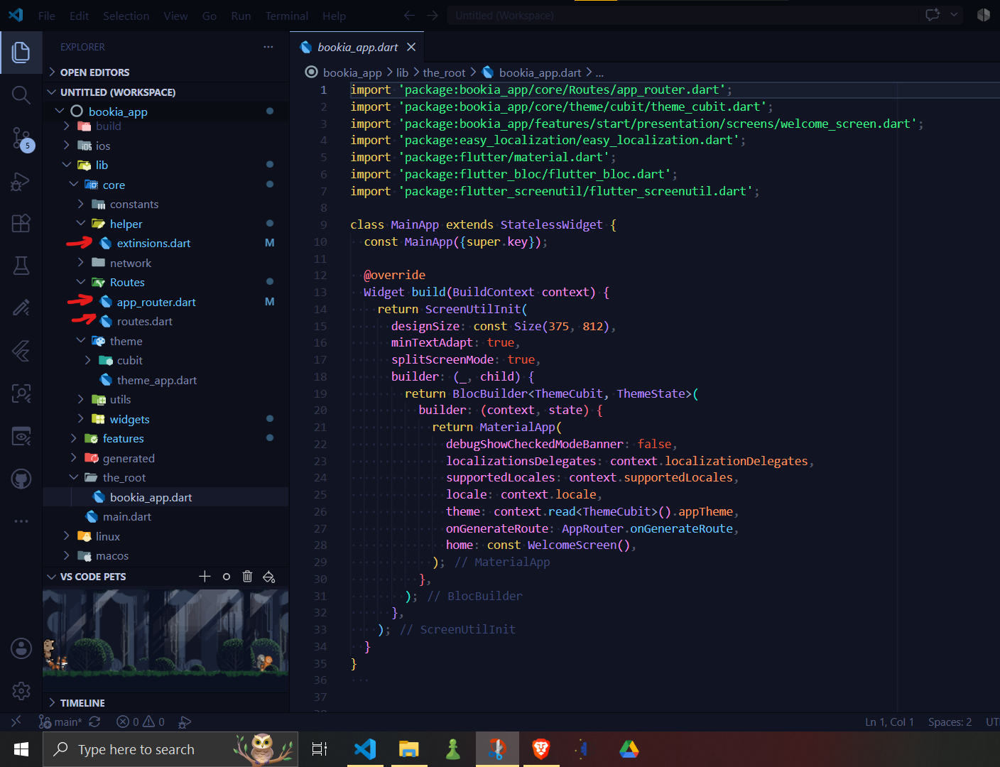
| **Key bordtype** | 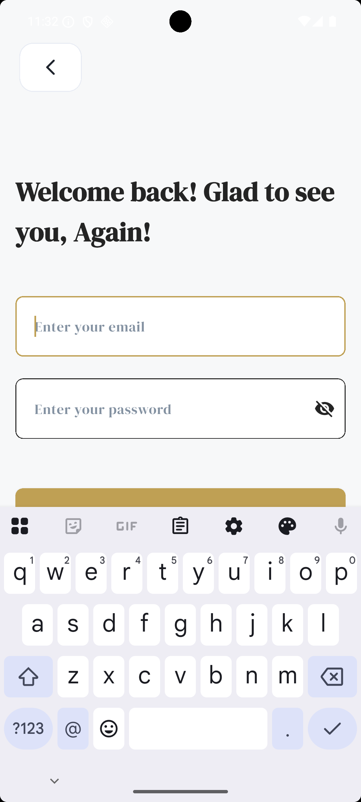 |
| **pass_fild** | 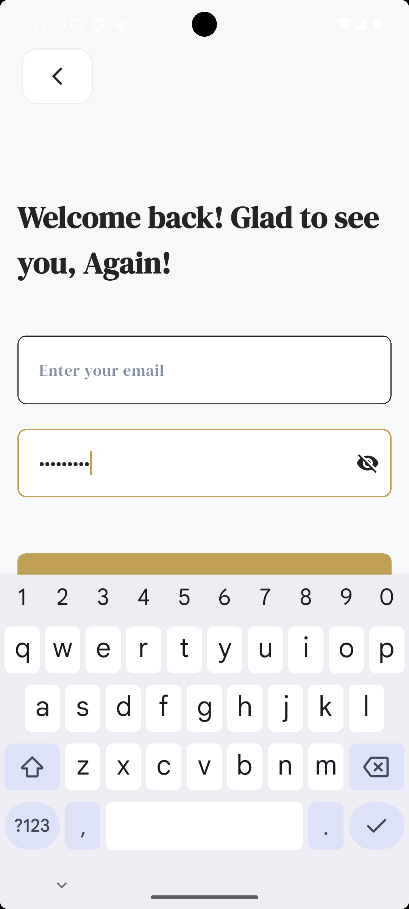 


### 🎨 Theme & Onboarding Preview

| Light Theme | Dark Theme |
| :---: | :---: |
|  <br> **Welcome (Light)** |  <br> **Welcome (Dark)** |
| 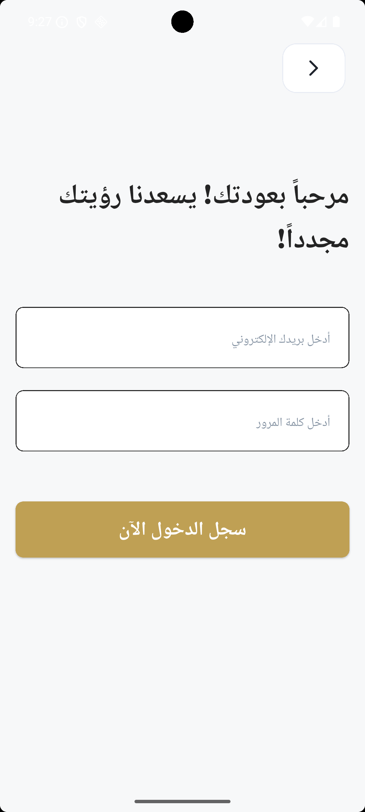 <br> **Login - Arabic** | 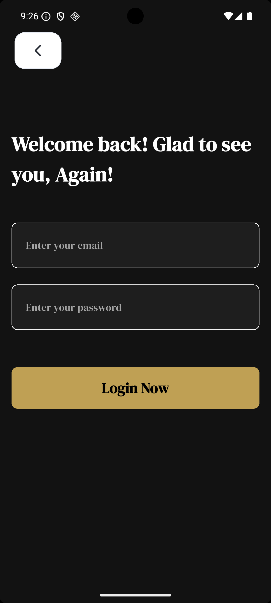 <br> **Login - Dark** |

---

### 🌐 Screen Gallery

#### ☀️ Light Mode
| Screen | Arabic (RTL) | English (LTR) |
| :--- | :---: | :---: |
| **Welcome** |  |  |
| **Login** |  | 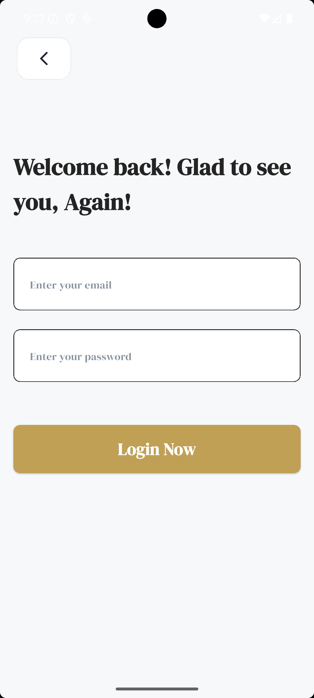 |
| **Register** | 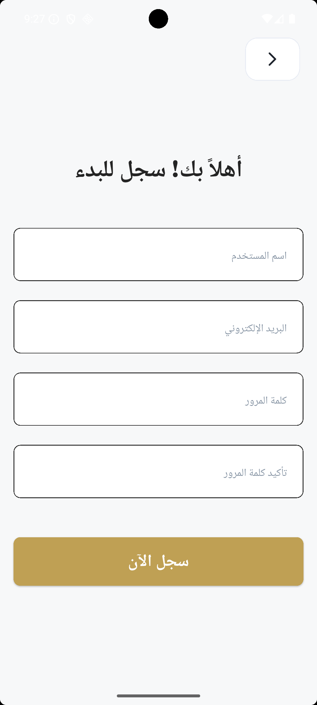 | 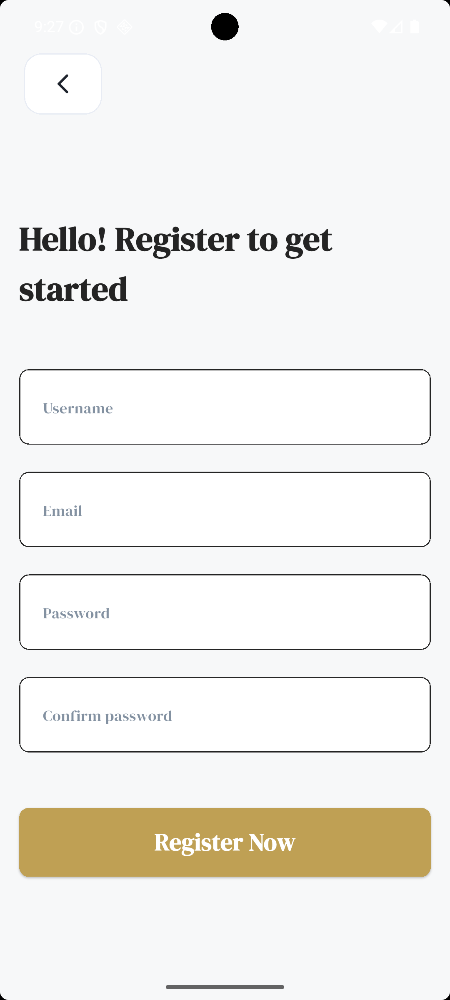 |

#### 🌙 Dark Mode
| Screen | Dark (Arabic) | Dark (English) |
| :--- | :---: | :---: |
| **Welcome** |  |  |
| **Login** | 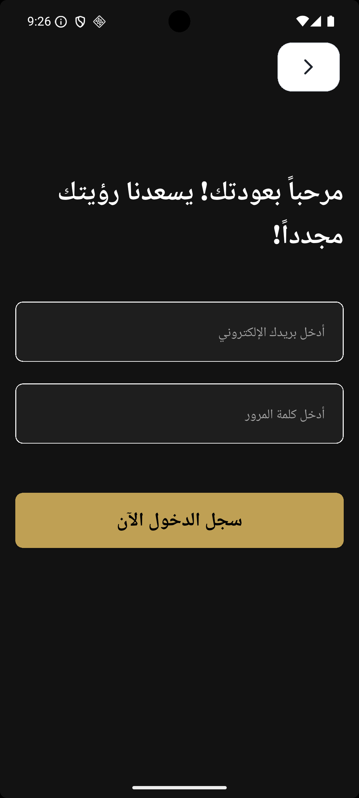 |  |
| **Register** | 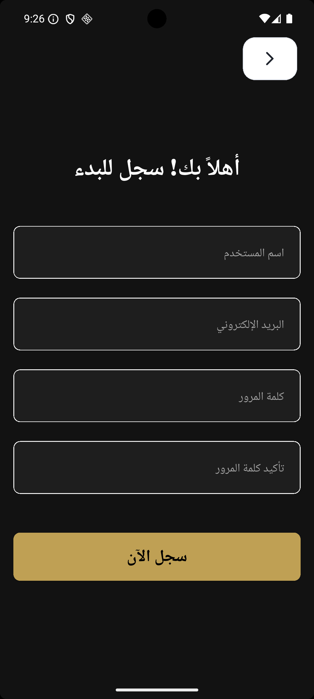 | 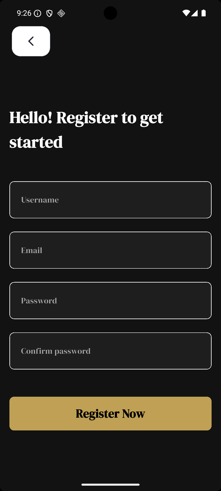 |

---
A new Flutter project.
## Code Generation Commands

### 1. Run Build Runner
لتوليد الأصول والملفات التلقائية ومسح أي تعارضات سابقة:
```bash
dart run build_runner build --delete-conflicting-outputs
```

### 2. Generate Localization Keys
لتوليد مفاتيح الترجمة من ملفات `ar.json` و `en.json`:
```bash
dart run easy_localization:generate --source-dir ./assets/translation -f keys -o locale_keys.g.dart -o lib/gen
```